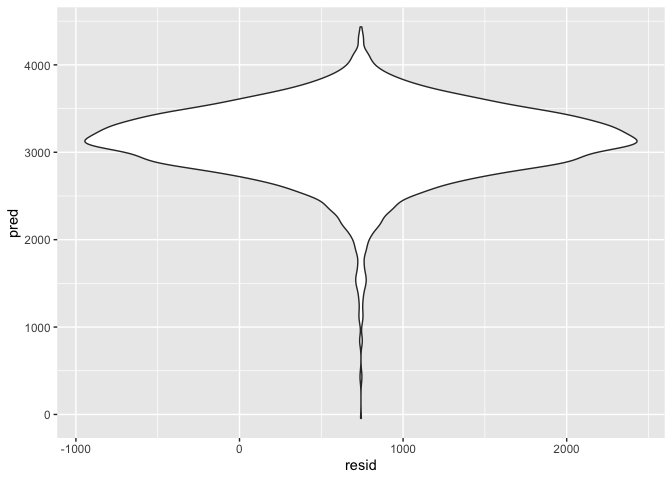
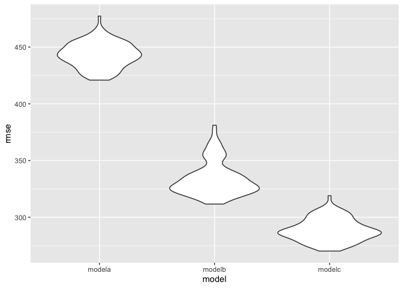

p8105\_hw6\_lc3391
================
Lu Chen
11/24/2019

Problem 1
=========

``` r
#importing and cleaning data
birthwgt = read_csv("./data/birthweight.csv", na="") %>% 
  mutate(
    babysex = factor(babysex),
    frace = factor(frace),
    mrace = factor(mrace),
    malform = factor(malform)
  )

#is.na(birthwgt) #there is no missing value in the dataset

#build a model A
fit = lm(bwt ~ babysex + delwt + fincome + gaweeks + smoken, data = birthwgt)
# after scanning variables in the dataset, I think the sex of baby, mother's smoking status and amount during pregancy, mother's weight at delivery, baby's gestational age in weeks could all affect the birthweight of newborn.

fit %>% broom::tidy()
```

    ## # A tibble: 6 x 5
    ##   term        estimate std.error statistic   p.value
    ##   <chr>          <dbl>     <dbl>     <dbl>     <dbl>
    ## 1 (Intercept)  -123.      90.7       -1.36 1.75e-  1
    ## 2 babysex2      -93.1     13.4       -6.94 4.52e- 12
    ## 3 delwt           5.56     0.304     18.3  6.50e- 72
    ## 4 fincome         2.22     0.260      8.54 1.83e- 17
    ## 5 gaweeks        61.1      2.15      28.4  1.76e-162
    ## 6 smoken         -7.76     0.909     -8.54 1.77e- 17

``` r
  birthwgt %>% 
  modelr::add_residuals(fit) %>% 
  modelr::add_predictions(fit) %>% 
  ggplot(aes(x = resid, y = pred)) + 
  geom_violin()
```


``` r
# Model B
fit2 = lm(bwt ~ blength + gaweeks, data = birthwgt) 

fit2 %>% broom::tidy()
```

    ## # A tibble: 3 x 5
    ##   term        estimate std.error statistic  p.value
    ##   <chr>          <dbl>     <dbl>     <dbl>    <dbl>
    ## 1 (Intercept)  -4348.      98.0      -44.4 0.      
    ## 2 blength        129.       1.99      64.6 0.      
    ## 3 gaweeks         27.0      1.72      15.7 2.36e-54

``` r
birthwgt %>% 
  modelr::add_residuals(fit2) %>% 
  modelr::add_predictions(fit2) %>% 
  ggplot(aes(x = resid, y = pred)) + 
  geom_violin()
```


``` r
# Model C

fit3 = lm(bwt ~ bhead + blength + babysex + bhead*babysex + bhead*blength + blength*babysex + bhead*blength*babysex, data = birthwgt)

fit3 %>% broom::tidy()
```

    ## # A tibble: 8 x 5
    ##   term                    estimate std.error statistic      p.value
    ##   <chr>                      <dbl>     <dbl>     <dbl>        <dbl>
    ## 1 (Intercept)            -7177.     1265.       -5.67  0.0000000149
    ## 2 bhead                    182.       38.1       4.78  0.00000184  
    ## 3 blength                  102.       26.2       3.90  0.0000992   
    ## 4 babysex2                6375.     1678.        3.80  0.000147    
    ## 5 bhead:babysex2          -198.       51.1      -3.88  0.000105    
    ## 6 bhead:blength             -0.554     0.780    -0.710 0.478       
    ## 7 blength:babysex2        -124.       35.1      -3.52  0.000429    
    ## 8 bhead:blength:babysex2     3.88      1.06      3.67  0.000245

``` r
birthwgt %>% 
  modelr::add_residuals(fit3) %>% 
  modelr::add_predictions(fit3) %>% 
  ggplot(aes(x = resid, y = pred)) + 
  geom_violin()
```



``` r
#making comparsion

cv_birthwgt = 
  crossv_mc(birthwgt, 100)

cv_birthwgt =
  cv_birthwgt %>% 
  mutate(
    train = map(train, as_tibble),
    test = map(test, as_tibble))

cv_birthwgt = 
  cv_birthwgt %>% 
  mutate(model_a  = map(train, ~lm(bwt ~ babysex + delwt + fincome + gaweeks + smoken, data = .x)),
         model_b  = map(train, ~lm(bwt ~ blength + gaweeks, data = .x)),
         model_c  = map(train, ~lm(bwt ~ bhead + blength + babysex + bhead*babysex + bhead*blength + blength*babysex + bhead*blength*babysex, data = .x))) %>% 
  mutate(rmse_modela = map2_dbl(model_a, test, ~rmse(model = .x, data = .y)),
         rmse_modelb = map2_dbl(model_b, test, ~rmse(model = .x, data = .y)),
         rmse_modelc = map2_dbl(model_c, test, ~rmse(model = .x, data = .y)))

cv_birthwgt %>% 
  select(starts_with("rmse")) %>% 
  pivot_longer(
    everything(),
    names_to = "model", 
    values_to = "rmse",
    names_prefix = "rmse_") %>% 
  mutate(model = fct_inorder(model)) %>% 
  ggplot(aes(x = model, y = rmse)) + geom_violin()
```



``` r
# from the plot, we see that the model c, with includes the head circumference, length, sex, and all interactions (including the three-way interaction) between these, fits the best (with lowest rmse value)
```

Problem 2
---------

``` r
#data importing

weather_df = 
  rnoaa::meteo_pull_monitors(
    c("USW00094728"),
    var = c("PRCP", "TMIN", "TMAX"), 
    date_min = "2017-01-01",
    date_max = "2017-12-31") %>%
  mutate(
    name = recode(id, USW00094728 = "CentralPark_NY"),
    tmin = tmin / 10,
    tmax = tmax / 10) %>%
  select(name, id, everything())
```

    ## Registered S3 method overwritten by 'crul':
    ##   method                 from
    ##   as.character.form_file httr

    ## Registered S3 method overwritten by 'hoardr':
    ##   method           from
    ##   print.cache_info httr

    ## file path:          /Users/kellychen/Library/Caches/rnoaa/ghcnd/USW00094728.dly

    ## file last updated:  2019-09-26 10:26:37

    ## file min/max dates: 1869-01-01 / 2019-09-30

``` r
set.seed(1)

weather_df %>% 
  modelr::bootstrap(n = 5000) %>% 
  mutate(
    models = map(strap, ~lm(tmax ~ tmin, data = .x)),
    results = map(models, broom::glance)) %>% 
  select(-strap, -models) %>% 
  unnest(results) %>% 
  select(.id,r.squared) %>% 
  ggplot(aes(x = r.squared)) +
  geom_density() +
  theme_bw()
```


``` r
# the distribution of  estimated r-square is about normal.

weather_df %>% 
  modelr::bootstrap(n = 5000) %>% 
  mutate(
    models = map(strap, ~lm(tmax ~ tmin, data = .x)),
    results = map(models, broom::tidy)) %>% 
  select(-strap, -models) %>% 
  unnest(results) %>% 
  select(.id,term,estimate) %>% 
  pivot_wider(names_from = term, values_from = estimate) %>% 
  mutate(log_beta0_beta1 = log(`(Intercept)`*tmin, base = exp(1))) %>% 
  ggplot(aes(x = log_beta0_beta1)) +
  geom_density() +
  theme_bw()
```


``` r
# the distribution of log(beta0*beta1) is about normal.

# 95% Confidence Interval

rsquared = 
weather_df %>% 
  modelr::bootstrap(n = 5000) %>% 
  mutate(
    models = map(strap, ~lm(tmax ~ tmin, data = .x)),
    results = map(models, broom::glance)) %>% 
  select(-strap, -models) %>% 
  unnest(results) %>% 
  select(.id,r.squared)
  
quantile(rsquared$r.squared, probs= c(0.025,0.975))
```

    ##      2.5%     97.5% 
    ## 0.8937522 0.9270975

``` r
log_f = 
  weather_df %>% 
  modelr::bootstrap(n = 5000) %>% 
  mutate(
    models = map(strap, ~lm(tmax ~ tmin, data = .x)),
    results = map(models, broom::tidy)) %>% 
  select(-strap, -models) %>% 
  unnest(results) %>% 
  select(.id,term,estimate) %>% 
  pivot_wider(names_from = term, values_from = estimate) %>% 
  mutate(log_beta0_beta1 = log(`(Intercept)`*tmin, base = exp(1)))

quantile(log_f$log_beta0_beta1, probs= c(0.025,0.975))
```

    ##     2.5%    97.5% 
    ## 1.967353 2.058287
